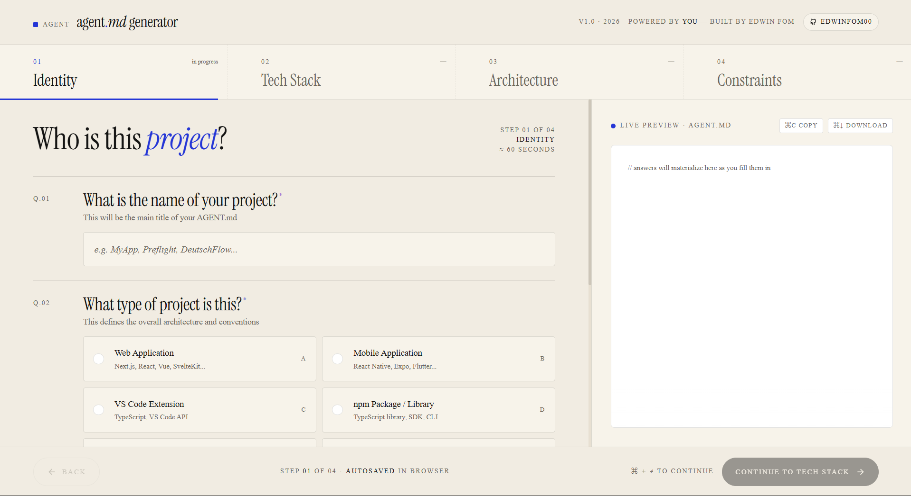

# agent.md generator

> Twelve questions. Four minutes. A production-grade AGENT.md your AI assistants will read before every keystroke.



A focused web app that guides you through a 4-step editorial flow and generates a complete, project-specific `AGENT.md` (or `CLAUDE.md`) powered by DeepSeek.

**[Live demo](https://packages.edwinfom.dev)** · **Built by [Edwin Fom](https://github.com/Edwinfom00)**

---

## What it does

Most developers use AI coding assistants without giving them any context about the project. The result: the AI writes code that doesn't match your conventions, introduces dependencies you didn't want, and ignores constraints you care about.

`AGENT.md` is a spec file you place at the root of your repo. AI assistants like Kiro, Cursor, Claude, and Copilot read it before every response. This app generates one for you in under 5 minutes.

---

## The flow

```
Step 01 · Identity      → project name, type, description
Step 02 · Tech Stack    → languages, frameworks, AI providers
Step 03 · Architecture  → folder structure, coding conventions, UI style
Step 04 · Constraints   → hard rules, development philosophy, extra context
         ↓
         Review → Generate → Download
```

Each step has a live preview pane on the right that shows the AGENT.md being built in real time.

---

## Tech stack

- **Next.js 16** — App Router, server components
- **TypeScript** — strict mode
- **Tailwind CSS v4** — utility-first, custom design tokens
- **Vercel AI SDK** — `generateText` for the generation call
- **DeepSeek** (`deepseek-chat`) — the LLM that writes the spec
- **react-icons** — icon set (Remix Icons)
- **Instrument Serif** + **Geist** + **JetBrains Mono** — typography

---

## Getting started

### Prerequisites

- Node.js >= 20
- A [DeepSeek API key](https://platform.deepseek.com/)

### Install

```bash
cd apps/agent-md-generator
npm install
```

### Configure

```bash
cp .env.local.example .env.local
```

Edit `.env.local`:

```env
DEEPSEEK_API_KEY=sk-your-key-here
```

### Run

```bash
npm run dev
```

Open [http://localhost:3000](http://localhost:3000).

---

## Project structure

```
src/
  app/
    page.tsx                  ← entry point (renders WizardShell)
    layout.tsx                ← root layout, fonts
    globals.css               ← Tailwind v4 + design tokens
    api/
      generate/route.ts       ← POST /api/generate — calls DeepSeek
  components/
    ui/
      AppHeader.tsx           ← top navigation bar
      AppFooter.tsx           ← step navigation (back / continue)
      StepRail.tsx            ← 4-step progress indicator
      PreviewPane.tsx         ← live AGENT.md preview (right column)
    wizard/
      WizardShell.tsx         ← main state machine (questions → review → output)
      QuestionField.tsx       ← renders text / textarea / select / multiselect
      ReviewStep.tsx          ← summary of all answers before generation
      GeneratingScreen.tsx    ← loading state during DeepSeek call
    output/
      ResultScreen.tsx        ← generated file viewer + download buttons
  lib/
    cn.ts                     ← clsx + tailwind-merge utility
    questions.ts              ← all 12 questions, options, dependency rules
    buildPrompt.ts            ← constructs the DeepSeek prompt from answers
  types/
    index.ts                  ← shared TypeScript types
```

---

## Design system

The design follows an editorial aesthetic inspired by the `_prototype/` folder:

| Token | Value |
|---|---|
| `--color-paper` | `#F1ECE2` — warm off-white background |
| `--color-ink` | `#141413` — near-black text |
| `--color-cobalt` | `#2536D6` — primary accent (blue) |
| `--color-ink-mute` | `#6B665B` — secondary text |
| `--font-serif` | Instrument Serif — headings, titles |
| `--font-mono` | JetBrains Mono — labels, code, metadata |
| `--font-sans` | Geist — body text, UI |

---

## Output

The generator produces two downloadable files with identical content:

- `AGENT.md` — for Kiro, Cursor, and most AI coding assistants
- `CLAUDE.md` — for Claude (Anthropic's naming convention)

Place either file at the root of your project repository.

---

## No data stored

All answers stay in the browser. The only network call is the DeepSeek API request from the server route — your answers are sent to DeepSeek to generate the spec, then discarded. Nothing is logged or persisted.

---

## License

MIT © [Edwin Fom](https://github.com/Edwinfom00)
